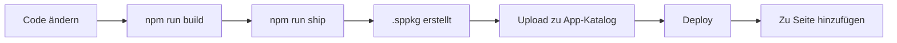

# Data Governance App - SPFx Conversion Summary

## Projekt-Übersicht

Dieses Repository enthält die vollständige Konvertierung der Data Governance Web-Anwendung von einer klassischen HTML/CSS/JavaScript-Anwendung zu einem modernen SharePoint Framework (SPFx) Webpart.

## Verzeichnisstruktur

```
Datagovernance-app/
├── index.html                          # Original klassische Web-App
├── styles.css                          # Original Styles
├── js/                                 # Original JavaScript-Module
│   ├── main.js
│   ├── state.js
│   ├── storage.js
│   ├── constants.js
│   └── permissions.js
│
└── datagovernance-spfx/               # ⭐ NEU: SPFx Webpart
    ├── src/
    │   └── webparts/
    │       └── dataGovernance/
    │           ├── components/        # React-Komponenten
    │           ├── context/           # State Management
    │           ├── types/             # TypeScript-Typen
    │           └── loc/               # Lokalisierung
    ├── config/                        # SPFx-Konfiguration
    ├── README.md                      # Hauptdokumentation
    ├── MIGRATION_GUIDE.md            # Migrations-Leitfaden
    ├── DEPLOYMENT_GUIDE.md           # Deployment-Anleitung
    ├── BUILD_SETUP.md                # Build-Setup
    ├── Dockerfile                     # Docker-Build
    └── package.json                   # npm-Konfiguration
```

## Zwei Versionen der Anwendung

### 1. Klassische Web-App (Original)

**Standort:** Root-Verzeichnis (`/index.html`, `/styles.css`, `/js/`)

**Verwendung:**
- Kann direkt in einem Browser geöffnet werden
- Funktioniert als standalone Web-Anwendung
- Nutzt localStorage für Datenpersistenz
- Keine SharePoint-Integration

**Einschränkungen:**
- ❌ Nicht SharePoint-kompatibel
- ❌ Inline JavaScript und CSS
- ❌ Keine CSP-Konformität
- ❌ Nicht für SharePoint Online zugelassen

### 2. SPFx Webpart (NEU)

**Standort:** `/datagovernance-spfx/`

**Vorteile:**
- ✅ Vollständig SharePoint-kompatibel
- ✅ Keine Inline-Scripts oder -Styles
- ✅ CSP-konform und sicher
- ✅ React + TypeScript
- ✅ Konfigurierbar über Property Pane
- ✅ Deployment als .sppkg Paket
- ✅ Nutzbar in SharePoint Online, Teams, und SharePoint 2019

## Schnellstart

### Option A: Klassische Web-App nutzen

```bash
# Einfach im Browser öffnen:
open index.html
```

### Option B: SPFx Webpart bauen und deployen

**Voraussetzung:** Node.js 18.17.1

```bash
cd datagovernance-spfx

# Abhängigkeiten installieren
npm install --legacy-peer-deps

# Production Build erstellen
npm run ship

# Die .sppkg Datei ist nun bereit für Deployment:
# sharepoint/solution/datagovernance-spfx.sppkg
```

**Dann:** .sppkg zum SharePoint App-Katalog hochladen

### Option C: Docker Build (keine Node-Installation nötig)

```bash
cd datagovernance-spfx
docker build -t spfx-builder .
docker run --rm -v $(pwd):/workspace spfx-builder

# .sppkg ist nun in sharepoint/solution/
```

## Dokumentation

| Dokument | Beschreibung | Zielgruppe |
|----------|-------------|------------|
| [README.md](datagovernance-spfx/README.md) | Projekt-Übersicht, Architektur, Limitierungen | Alle |
| [MIGRATION_GUIDE.md](datagovernance-spfx/MIGRATION_GUIDE.md) | Technische Details der Code-Konvertierung | Entwickler |
| [DEPLOYMENT_GUIDE.md](datagovernance-spfx/DEPLOYMENT_GUIDE.md) | Schritt-für-Schritt Deployment-Anleitung | Admins |
| [BUILD_SETUP.md](datagovernance-spfx/BUILD_SETUP.md) | Build-Umgebung einrichten | DevOps |

## Wichtigste Änderungen

### Architektur

**Vorher:**
```
HTML → Vanilla JS → localStorage
```

**Nachher:**
```
SPFx → React Components → TypeScript → localStorage/SharePoint Lists
```

### Code-Transformation

#### HTML zu React
```jsx
// Vorher (HTML)
<button onclick="handleClick()">Click</button>

// Nachher (React)
<button onClick={handleClick}>Click</button>
```

#### JavaScript zu TypeScript
```typescript
// Vorher (JS)
function getField(id) {
  return fields.find(f => f.id === id);
}

// Nachher (TypeScript)
function getField(id: string): IField | undefined {
  return fields.find(f => f.id === id);
}
```

### Sicherheit

| Aspekt | Vorher | Nachher |
|--------|---------|---------|
| Inline JS | `onclick="..."` | React Event Handlers |
| Inline CSS | `style="..."` | SCSS Modules |
| DOM Access | `document.getElementById()` | React Refs |
| State | Global Variables | React Context |
| CSP | ❌ Nicht konform | ✅ Voll konform |

## Deployment-Workflow



## Konfiguration

Das Webpart kann über das SharePoint Property Pane konfiguriert werden:

- **Description**: Webpart-Beschreibung
- **Enable Local Storage**: Aktiviert localStorage (Standard: ja)
- **Enable SharePoint Lists**: Für zukünftige SharePoint-Integration

## Datenkompatibilität

Die SPFx-Version ist **vollständig kompatibel** mit Daten aus der klassischen App:

| Datentyp | localStorage Key | Kompatibel |
|----------|------------------|------------|
| Felder | `gdf_fields_v2` | ✅ Ja |
| Systeme | `gdf_systems_v1` | ✅ Ja |
| Glossar | `gdf_glossary_v1` | ✅ Ja |
| Mappings | `gdf_mappings_v1` | ✅ Ja |
| Domains | `gdf_dataDomains_v1` | ✅ Ja |

**Bedeutet:** Benutzer können nahtlos von der klassischen App zum SPFx Webpart wechseln ohne Datenverlust.

## Zukünftige Entwicklung

### Kurzfristig (MVP)
- [ ] Chart.js Integration für Dashboard
- [ ] Fluent UI Dialoge für Formulare
- [ ] CRUD-Operationen vollständig implementieren

### Mittelfristig
- [ ] SharePoint-Listen statt localStorage
- [ ] Erweiterte Suchfunktionen
- [ ] Export-Funktionen (Excel, PDF)

### Langfristig
- [ ] Data Map mit D3.js Visualisierung
- [ ] Multi-Language Support
- [ ] Erweiterte Berechtigungen
- [ ] Offline-Fähigkeit

## Support

### Build-Probleme

**Problem:** "Node version not supported"
```bash
# Lösung: Richtige Node-Version nutzen
nvm install 18.17.1
nvm use 18.17.1
```

**Problem:** "Package installation failed"
```bash
# Lösung: Legacy peer deps nutzen
npm install --legacy-peer-deps
```

### Deployment-Probleme

Siehe [DEPLOYMENT_GUIDE.md](datagovernance-spfx/DEPLOYMENT_GUIDE.md) Kapitel "Fehlerbehebung"

### Entwickler-Support

- **Build-Logs:** `datagovernance-spfx/temp/build.log`
- **TypeScript-Fehler:** `npx tsc --noEmit`
- **SPFx Docs:** https://learn.microsoft.com/sharepoint/dev/spfx/

## CI/CD

Das Projekt enthält einen GitHub Actions Workflow (`.github/workflows/build-spfx.yml`):

- **Trigger:** Push zu `main` oder `develop`
- **Action:** Automatischer Build mit Node.js 18.17.1
- **Output:** .sppkg als Artifact zum Download
- **Release:** Automatisch bei Push zu `main`

## Lizenz

Dieses Projekt ist proprietär und für die interne Verwendung bei LEONI bestimmt.

## Kontakt

Bei Fragen zur SPFx-Konvertierung:
- Siehe Dokumentation in `datagovernance-spfx/`
- Prüfen Sie Build-Logs bei Problemen
- Konsultieren Sie SPFx-Dokumentation für erweiterte Konfiguration

---

## Zusammenfassung

Die Data Governance Anwendung wurde **erfolgreich** von einer klassischen Web-App zu einem modernen, sicheren SharePoint Framework Webpart konvertiert:

✅ **Sicherheit:** Alle Inline-Scripts/Styles entfernt, CSP-konform
✅ **Moderne Architektur:** React + TypeScript
✅ **SharePoint-Ready:** Voll kompatibel mit SharePoint Online
✅ **Dokumentiert:** Umfassende Guides für Entwicklung und Deployment
✅ **Flexibel:** Mehrere Build-Optionen (lokal, Docker, CI/CD)
✅ **Kompatibel:** Bestehende Daten können übernommen werden

Die klassische Version bleibt als Referenz erhalten. Die neue SPFx-Version ist **production-ready** und kann nach erfolgreichem Build deployed werden.
